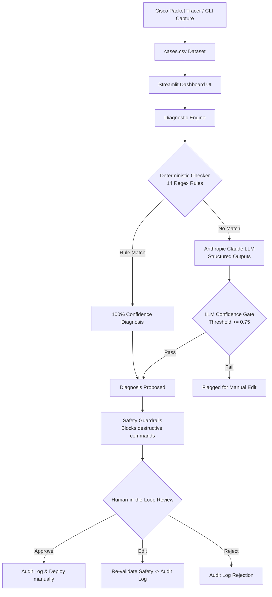

# 🌐 NetSage AI
> **An AI Troubleshooting Helper with Human Review**

NetSage AI is an enterprise-grade, AI-assisted network fault-diagnosis platform built for Cisco IOS and Cisco Packet Tracer environments. It acts as an intelligent troubleshooting co-pilot for network engineers—it never replaces the engineer, and it never executes commands autonomously.

---

## 🏗️ System Architecture & Data Flow



## ✨ Key Features

- **Hybrid Diagnostic Engine**: Combines a deterministic rule checker (14 active fault signatures) for fast, zero-cost diagnosis of known faults, with a Claude-powered LLM reasoning layer for complex, unseen scenarios.
- **Mandatory Human-in-the-Loop (HITL)**: All remediation proposals are gated behind a strict review process (Approve/Edit/Reject). The AI is purely advisory.
- **Strict Safety Guardrails**: Built-in regex policies block destructive commands (`reload`, `write erase`, etc.) before they ever reach the human approval stage.
- **Comprehensive Dataset**: Includes **33 verified troubleshooting cases** with 8 structured fields (symptom, topology, exact show outputs, OSI layer, expected fault).
- **Responsible AI Audit Trail**: Every decision made by the AI and the human engineer is permanently logged in a markdown table. The repository includes 5 documented Responsible AI case studies of human correction.
- **Operations Dashboard**: A 5-tab Streamlit dashboard to manage diagnostics, analyze agreement metrics, and view real-time audit logs.

## 🚀 Quick Start Guide

### 1. Prerequisites
- **Python 3.9+** (Tested on Python 3.12.6)
- **Cisco Packet Tracer** (To load the `.pkt` lab demonstration)

### 2. Installation
Clone the repository and install dependencies:
```bash
git clone <repository_url>
cd ai_cisco
python -m venv venv
# Windows
venv\Scripts\activate
# Linux/macOS
source venv/bin/activate

pip install -r requirements.txt
```

### 3. API Key (Optional for LLM Path)
Cases NET-001 to NET-013 run on the local deterministic engine (no API key needed). For cases NET-014 to NET-033, set your Anthropic API key:
```powershell
# Windows PowerShell
$env:ANTHROPIC_API_KEY="sk-ant-api03-..."
```
```bash
# macOS/Linux
export ANTHROPIC_API_KEY="sk-ant-api03-..."
```

### 4. Run the Dashboard
```bash
streamlit run src/app.py
```
Open `http://localhost:8501` in your browser.

## 🧪 Automated Testing
Run the full 7-test suite to verify the logic, routing, and safety guardrails:
```bash
python -m pytest tests/ -v
```

## 📂 Repository Structure

- `src/`: Core logic (`engine.py`, `checker.py`, `safety.py`, `app.py`)
- `data/`: The 33-case dataset (`cases.csv`) and system config
- `prompts/`: LLM system prompts and few-shot examples
- `packet_tracer/`: Fully documented lab for the NET-001 demo
- `docs/`: Audit logs, Responsible AI case studies, and test reports
- `Submission_documentation/`: Complete 15-part technical documentation

## 👥 Team & Contributors

| Role | Name | Email | Roll No / ID | AICTE ID | Contributions |
|---|---|---|---|---|---|
| **Team Lead** | Rajkaran Yadav | yadavrajkaran854@gmail.com | 0103CS231317 | STU681010bec40271745883326 | Architecture Design, System Orchestration, Streamlit Dashboard UI, LLM Prompt Engineering, & Responsible AI Integration |
| **Member** | Navneet Kumar | navneet23ub@gmail.com | 0103CS231254 | STU69d29374790331775407988 | Deterministic Rule Engine (Regex), Dataset Curation, Packet Tracer Lab Design, Safety Guardrails, & Automated Testing |

## 📄 License
This project is licensed under the MIT License.
